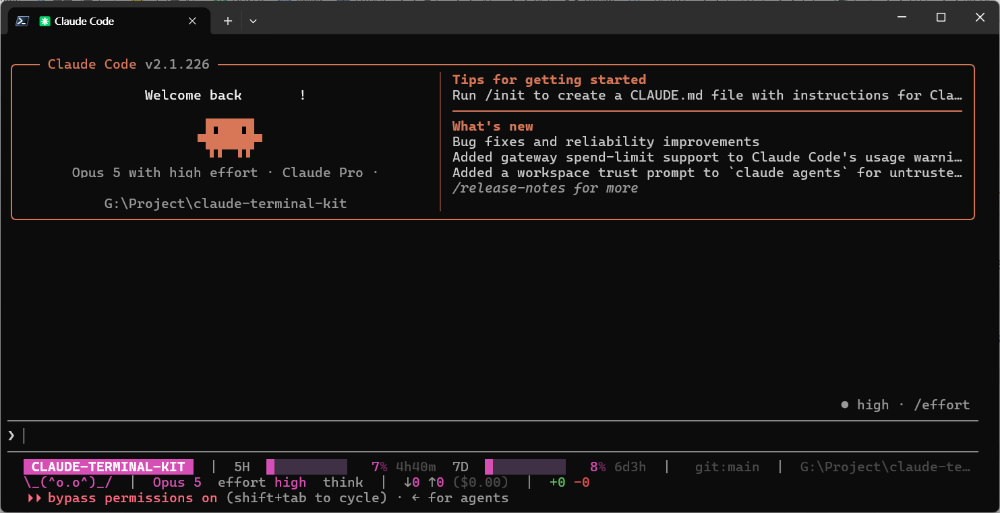

# claude-terminal-kit

Claude Code 창을 여러 개 띄워놓고 일할 때, **지금 보고 있는 창이 어느 프로젝트인지**
색으로 즉시 알아보기 위한 Windows Terminal용 status line입니다.



## 왜 만들었나

프롬프트 창을 여럿 띄워놓으면 창들이 전부 똑같이 생겼습니다. 방금 명령을 넣은 게 어느 창이었는지,
지금 이 창이 어느 저장소인지 매번 경로를 눈으로 읽어야 합니다. 창이 네다섯 개를 넘어가면
"어느 창에 뭘 시켰더라"가 실제 사고로 이어집니다.

가장 먼저 떠오르는 해법은 **창 제목에 프로젝트명을 박는 것**인데, 이건 쓸 수 없습니다.
Claude Code가 제목표시줄을 이미 쓰고 있기 때문입니다 — 세션명과 작업 상태(작업 중 / 완료)를
거기에 표시하고, 수시로 다시 씁니다. 끼어들면 둘 중 하나가 죽습니다.
제목을 고정하면 작업 상태 표시가 사라지고, 고정하지 않으면 프로젝트명이 곧바로 덮어써집니다.

그래서 **제목표시줄은 Claude Code에게 그대로 넘기고, 프로젝트 식별을 세션 하단으로 옮겼습니다.**
프로젝트마다 고유한 색을 배정해 배지로 찍고, 게이지도 같은 색으로 그립니다.
목적은 읽는 게 아니라 **훑어서 알아보는 것**입니다.

어차피 한 줄을 쓰기로 한 김에, 창을 옮겨다니지 않고도 알아야 하는 것들을 같이 올렸습니다 —
계정 사용량 한도가 얼마나 남았는지, 컨텍스트에 여유가 있는지, 이 세션이 얼마를 썼는지.

## 무엇이 보이는가

```
 CLAUDE-TERMINAL-KIT  |  5H ███░░░░░░░  7% 4h40m  7D ███░░░░░░░  8% 6d3h  |  git:main  |  G:\Project\claude-te…
 \_(^o.o^)_/  |  Opus 5  effort high  think  |  ↓0 ↑0 ($0.00)  |  +0 -0
```

| 표시 | 뜻 |
|---|---|
| `CLAUDE-TERMINAL-KIT` | 프로젝트명. 배경색이 그 프로젝트의 고유색이고, 게이지 색도 같은 색을 씁니다 |
| `CTX` | 이 대화의 컨텍스트 사용률 (세션마다 다름). 위 화면처럼 갓 시작한 세션에서는 아직 나오지 않습니다 |
| `5H` / `7D` | 계정 5시간/주간 한도. **열려 있는 모든 창이 같은 값**을 보고, 옆의 `4h40m` 은 리셋까지 남은 시간 |
| `git:main` | 현재 브랜치. `git.exe` 를 띄우지 않고 `.git\HEAD` 를 직접 읽습니다 |
| 경로 | 폭이 모자라면 뒤에서 잘립니다. 프로젝트명은 배지에 이미 있으니 여기서 잘려도 됩니다 |
| `\_(^o.o^)_/` | 고양이. 유휴 / 작업 중 / 분노(서브에이전트)를 몸짓으로 알려줍니다 — [자세히](#고양이) |
| `Opus 5` `effort high` `think` | 지금 걸려 있는 모드. `FAST`, `style`, `agent`, vim 모드도 켜져 있을 때만 나옵니다 |
| `↓ / ↑` | 세션 누적 읽기/쓰기 토큰과 추정 비용 |
| `+0 -0` | 세션 중 추가/삭제된 코드 줄 수 |

**게이지 갱신 시점은 명령 제출 시와 완료 시 두 번뿐입니다.** 명령 도중에 숫자가 계속 꿈틀대면
직전 명령과 비교가 안 되기 때문입니다. 반면 `effort` 같은 모드 표시는 실시간입니다.

## 고양이

둘째 줄 맨 앞의 고양이는 장식이면서 동시에 **지금 뭐가 돌고 있는지**를 알려주는 표시입니다.
숫자를 읽지 않아도, 시야 구석에서 움직이는지 아닌지만으로 상태가 잡힙니다.

| 상태 | 프레임 | 언제 |
|---|---|---|
| 유휴 | `\_(^o.o^)_/` | 아무것도 돌지 않을 때. 앞발을 내리고 눈을 뜬 상태 |
| 조는 중 | `\_(^-.-^)_/` | 유휴가 이어질 때 7틱에 한 번, 눈만 감았다 뜹니다 |
| 작업 중 | `*_(^o.o^)b'` ↔ `'d(^o.o^)_*` | Claude가 응답을 만드는 동안. 양쪽 앞발이 매 프레임 자리를 바꿔 책상을 두드립니다 |
| 분노 | `*_(#>.<#)b'` ↔ `'d(#>.<#)_*` | 서브에이전트가 돌 때. 귀 자리에 `#` 힘줄이 서고 눈이 질끈 감깁니다 |

읽는 법:

- `\_` `_/` 는 **내려놓은 앞발**, `d` `b` 는 **치켜든 앞발**입니다. 두 프레임이 번갈아 나오면서
  왼발과 오른발이 교대로 내려찍힙니다.
- `*` 는 앞발이 책상에 닿은 **충격**, `'` 는 튀어 오른 앞발의 **잔상**입니다.
  그래서 둘은 항상 반대쪽 끝에 붙습니다.
- 프레임은 딱 두 개입니다. 상태줄이 다시 그려질 때만 다음 프레임으로 넘어가는데 작업 중에도
  초당 한 번 꼴이라, 프레임을 늘리면 빨라 보이는 게 아니라 **느리게 허우적대는 것처럼** 보입니다.
  두 프레임에 진폭을 최대로 주는 쪽이 매 갱신마다 앞발이 완전히 바뀌어 더 격렬해 보입니다.

**분노가 작업 중보다 우선합니다.** 서브에이전트가 돌고 있으면 메인 루프가 응답을 기다리며
가만히 있어도 일은 진행 중이기 때문입니다.

**작업 중인지는 추측입니다.** statusLine으로 들어오는 데이터에는 "지금 생각하는 중" 같은 필드가
없어서, **얼마나 자주 다시 불리는지**로 판단합니다. 타이머만 도는 유휴 상태에서는 `refreshInterval`
간격(3초)으로 불리는데, 그보다 빨리 불린다는 건 이벤트가 터지고 있다는 뜻이고 그게 곧 작업 중입니다.
경계는 1.8초입니다 — 실제 작업 중 간격이 0.7~1초쯤이라 두 대역 사이에 놓았습니다.
`refreshInterval` 을 바꾸면 이 값도 같이 손봐야 합니다. (예전에 경계가 0.9초였을 때는 그 값이
작업 중 대역을 정통으로 갈라서, 명령 도중에 고양이가 작업/유휴를 오갔습니다.)

**유휴는 "당신이 타이핑 중"의 대역입니다.** 프롬프트 입력창은 상태줄에서 볼 수 없습니다 —
입력 버퍼가 데이터로 들어오지 않고, 키 입력은 상태줄을 다시 그리게 하는 이벤트도 아닙니다.
Claude가 일하지 않는다면 키보드 앞의 사람이 일하는 중이라는 게 가장 정직한 근사치입니다.

**분노는 마지막 서브에이전트가 끝난 뒤 몇 초 더 남습니다.** 감시 스크립트는 에이전트 패널이 비는
순간 실행이 멈추기 때문에 "다 끝났다"고 알려줄 기회 자체가 없습니다. 그래서 마커를 지우는 대신
12초가 지나면 낡은 것으로 칩니다. 이 창을 짧게 잡았더니 틱 하나만 늦어도 분노가 풀렸다 걸렸다 했고,
길게 잡아서 생기는 손해는 분노가 몇 초 더 남는 것뿐입니다.

고양이는 **전부 ASCII**입니다. 블록·음표 문자(`▁`, `♪`, `∩`)는 East-Asian *ambiguous* 폭이라
CJK 폰트에서 두 칸으로 그려지고, 그러면 뒤따르는 정보와 열이 어긋납니다.

세션마다 프레임 카운터를 따로 두기 때문에(`%TEMP%\cc-bongo-<세션>.txt`),
창을 여러 개 띄워도 각자 자기 박자로 움직입니다.

## 요구사항

- Windows + Windows Terminal
- PowerShell 7 이상 — `winget install Microsoft.PowerShell`
- Claude Code (`statusLine` / `subagentStatusLine` 지원 버전. 2.1.220에서 검증)

## 설치

PowerShell **7** 창(`pwsh`)에서 한 줄이면 됩니다.

```powershell
irm https://raw.githubusercontent.com/Berry-G/claude-terminal-kit/main/bootstrap.ps1 | iex
```

저장소 압축본을 임시 폴더에 받아 `install.ps1` 을 실행하고, 끝나면 임시 폴더를 지웁니다.
키트 본체는 `~\.claude` 에 설치되므로 받은 폴더를 남겨둘 필요가 없습니다.

`iex` 는 인자를 넘길 수 없어서, 옵션은 **환경변수**로 받습니다:

```powershell
$env:CCKIT_ROOT   = 'G:\Project'       # 프로젝트 폴더 위치 (자동 감지와 다를 때)
$env:CCKIT_RECENT = '12'               # 최근 쓴 프로젝트 12개의 탭 프로필까지 생성
irm https://raw.githubusercontent.com/Berry-G/claude-terminal-kit/main/bootstrap.ps1 | iex
```

| 환경변수 | 대응 옵션 |
|---|---|
| `CCKIT_ROOT` | `-Root <경로>` |
| `CCKIT_RECENT` | `-Recent <N>` |
| `CCKIT_TITLEHOOK=1` | `-TitleHook` |
| `CCKIT_NOALIAS=1` | `-NoAlias` |
| `CCKIT_BRANCH` | 받아올 브랜치 (기본 `main`) |

### 저장소를 받아서 설치

옵션을 자주 바꾸거나 스크립트를 직접 손볼 생각이면 이쪽이 편합니다.

```powershell
git clone https://github.com/Berry-G/claude-terminal-kit.git
cd claude-terminal-kit
.\install.ps1
```

git이 없으면 [ZIP 다운로드](https://github.com/Berry-G/claude-terminal-kit/archive/refs/heads/main.zip) 후
압축을 풀고, 폴더에서 `Get-ChildItem -Recurse | Unblock-File` 을 한 번 실행한 다음 `.\install.ps1` 을 돌리세요.
(인터넷에서 받은 파일에는 Windows가 차단 표시를 붙입니다. 원라이너 쪽은 이걸 알아서 떼어냅니다.)

### 옵션

| 옵션 | 설명 |
|---|---|
| `-Root <경로>` | 프로젝트 폴더들이 모여 있는 경로 |
| `-Recent <N>` | 설치 직후 최근 사용 프로젝트 N개의 탭 프로필 생성 |
| `-TitleHook` | 창 제목 앞에 프로젝트명을 붙이는 훅도 설치 (선택) |
| `-NoAlias` | PowerShell 프로필에 `cc` 함수를 추가하지 않음 |
| `-Uninstall` | 제거 |

`-TitleHook` 은 선택입니다. status line만으로도 프로젝트 식별은 충분하고,
이 훅은 콘솔마다 감시 프로세스를 하나씩 띄웁니다. 제목까지 이중으로 표시하고 싶을 때만 쓰세요.

**프로젝트 루트**는 프로젝트 폴더들이 나란히 들어 있는 상위 폴더입니다(`G:\Project` 아래
`G:\Project\claude-terminal-kit`, `G:\Project\fletcher` … 처럼). `cc` 가 이 폴더를 훑어
목록을 만들고, 색도 여기 있는 폴더명 기준으로 배정됩니다.

지정하지 않으면 이 순서로 찾습니다:

1. 고정 드라이브 전체(`C:`, `D:`, `G:` …)에서 `\Project`, `\Projects`, `\Dev`, `\src`, `\Code`, `\repos`, `\workspace`
2. `%USERPROFILE%` 아래 `source\repos`, `Projects`, `Dev`, `git`, `repos`
3. 웹 스택 docroot — `laragon\www`, `D:\www`, `C:\xampp\htdocs`, `C:\wamp64\www`

엉뚱한 곳을 잡았다면 `-Root` 로 다시 설치하면 됩니다(`~\.claude\cc-config.json` 에 기록됩니다).

### 설치 후

```powershell
. $PROFILE     # 또는 터미널을 새로 열기 -> cc 명령 사용 가능
```

**status line은 Claude Code 세션을 새로 시작해야 나타납니다.** `settings.json` 은 세션 시작 시에만
읽히기 때문에, 이미 열려 있는 창은 설치해도 바뀌지 않습니다.

설치 스크립트는 PowerShell 7 여부를 먼저 확인하고, `settings.json` 은 백업 후 **병합**하며
(기존 `model`·`theme`·훅 설정은 그대로 둡니다), 마지막에 실제 페이로드로 렌더링을 검증합니다.

### 업데이트

**설치와 똑같은 명령을 다시 실행하면 됩니다.** `install.ps1` 은 멱등이라 몇 번을 돌려도 안전하고,
`cc-colors.json`(프로젝트별 색 배정)은 건드리지 않으므로 색도 그대로 유지됩니다.

### 설치를 Claude Code에게 맡기려면

대상 PC에서 Claude Code를 열고 이 프롬프트를 그대로 붙여넣으세요:

> https://github.com/Berry-G/claude-terminal-kit 을 이 PC에 설치해줘.
> `README.md` 의 "무엇을 건드리는가" 절을 먼저 읽고, 내 기존 `~\.claude\settings.json` 이
> 덮어써지지 않는지 확인해줘. 설치 후에는 스모크 테스트 결과를 보여주고,
> 상태줄이 실제로 그려지는지 확인해줘. PowerShell 7이 없으면 먼저 알려줘.

### PC를 바꿀 때 옮길 필요 없는 것

- `cc-colors.json` — 그 PC의 프로젝트별 색 배정입니다. 프로젝트 이름이 다른 PC에서는 의미가 없고,
  없으면 해시 + 실시간 협상으로 알아서 배정됩니다. 같은 프로젝트를 양쪽에서 쓴다면 복사해도 됩니다.
- `cc-config.json` — 설치할 때 대상 PC에서 다시 감지합니다.
- `%TEMP%\cc-*` — 실행 중 상태라 자동 재생성됩니다.

## 사용법

```powershell
cc                          # 프로젝트 목록
cc claude-terminal-kit      # 색 지정된 새 탭에서 claude 실행
cc terminal                 # 부분 매칭 (모호하면 후보를 알려줌)
cc fletcher -NewWindow      # 새 창으로

# 자주 쓰는 프로젝트는 아예 탭 프로필로 등록 (새 탭 메뉴에 나옴)
~\.claude\tools\New-CCProfiles.ps1 -Recent 20
~\.claude\tools\New-CCProfiles.ps1 -Projects claude-terminal-kit,fletcher
~\.claude\tools\New-CCProfiles.ps1 -Clean     # 생성된 프로필 전부 제거
```

프로젝트가 수십 개라면 전부 프로필로 만들지 마세요(새 탭 메뉴가 길어집니다).
**자주 쓰는 것만 프로필로, 나머지는 `cc` 로** 여는 조합을 권합니다.

## 무엇을 건드리는가

| 대상 | 동작 |
|---|---|
| `~\.claude\statusline.ps1`, `cc-palette.ps1`, `bongocat.ps1`, `subagent-statusline.ps1`, `tools\*.ps1` | 복사 (새 파일) |
| `~\.claude\settings.json` | `statusLine` / `subagentStatusLine` 키만 추가/갱신, 나머지 설정과 기존 훅은 그대로 병합 |
| `~\.claude\cc-config.json` | 프로젝트 루트 경로 기록 |
| `~\.claude\cc-colors.json` | 프로젝트별 색상 배정 기록 |
| `%TEMP%\cc-*` | 실행 중 상태 (색 점유, 게이지 래치, 토큰 오프셋, 줄 캐시). 지워도 자동 재생성 |
| Windows Terminal `settings.json` | `CC <프로젝트>` 프로필만 추가/갱신 (`New-CCProfiles.ps1` 실행 시) |
| PowerShell `$PROFILE` | `cc` 함수 한 줄 추가 |

수정하는 모든 JSON은 같은 위치에 `.bak` 백업을 남깁니다.

**4개 스크립트는 한 세트입니다.** `statusline.ps1` 이 같은 폴더의 `cc-palette.ps1` 과
`bongocat.ps1` 을 dot-source 하고, `subagent-statusline.ps1` 이 남기는 마커 파일을 읽습니다.
하나라도 빠지면 첫 dot-source에서 죽습니다. 그래서 설치 스크립트는 넷을 항상 함께 복사하고,
빠진 게 있으면 시작 전에 중단합니다.

설치 마지막에 **실제 페이로드를 먹여 렌더링을 확인**합니다. 등록만 되고 그려지지 않는 상태로
끝나지 않게 하기 위한 것으로, 출력이 비면 설치가 실패로 끝납니다.

## 제거

```powershell
.\install.ps1 -Uninstall
```

생성된 탭 프로필, `statusLine` 설정, `cc` 함수, 복사된 스크립트를 모두 제거합니다.
색상 배정(`cc-colors.json`)은 남겨두므로, 나중에 재설치해도 각 프로젝트가 쓰던 색이 그대로 복원됩니다.

## 동작 원리

- **색 배정**: 프로젝트명 MD5 해시로 팔레트(16색) 시작점을 잡지만, 해시만으로는 충돌을 못 막습니다
  (16칸에 5개만 넣어도 충돌 확률이 절반을 넘고, 실제로 세 프로젝트가 같은 색이었습니다).
  그래서 **열려 있는 창들과 협상**합니다. 각 창이 렌더링마다 `%TEMP%\cc-colors-live.txt` 에
  자기 색을 재등록하고, 새 창은 이미 점유된 색을 피합니다. 같은 색을 동시에 잡으면 **먼저 잡은 쪽이
  이기고** 나중 쪽이 비켜납니다. 창을 닫으면 30초 뒤 색이 반납됩니다.
  같은 프로젝트를 두 창에서 열면 색을 공유합니다.
- **제목 보존**: 생성되는 탭 프로필에는 `tabTitle` 과 `suppressApplicationTitle: true` 를
  **의도적으로 넣지 않습니다**. 둘 중 하나라도 켜면 제목이 고정되어 Claude Code의 작업 상태 표시가 죽습니다.
- **한도 동기화**: `5H`/`7D` 는 계정 단위라 `%TEMP%\cc-usage-shared.txt` 하나를 모든 창이 공유합니다.
  어느 창이든 샘플 시점에 도달하면 값을 게시하므로, 놀고 있는 창의 막대도 다른 창이 일하면 같이 움직입니다.
  공유 값은 **뒤로 가지 않습니다** — 오래 놀던 창이 자기 낡은 관측치로 남의 최신 값을 덮어쓰지 않게,
  `resets_at` 이 더 나중인 관측을 더 새로운 것으로 판정합니다.
- **인코딩**: stdin/stdout을 UTF-8 바이트로 직접 다룹니다. `[Console]::OutputEncoding` 은
  **설정하지 않습니다** — 그 한 줄이 콘솔을 재초기화하느라 240ms를 먹었습니다.
- **문자 폭**: 막대는 글리프가 아니라 **배경색을 칠한 공백**입니다. 블록·괘선·도형 문자는 전부
  East-Asian *ambiguous* 폭이라 CJK 폰트에서 두 칸으로 그려져 정렬이 깨집니다. 공백은 어떤 폰트에서도
  한 칸입니다.
- **속도**: 렌더 1회가 ~650ms이고 그중 ~580ms가 pwsh 기동과 첫 콘솔 접근입니다. Claude Code는
  실행 중인 스크립트를 다음 트리거가 오면 **취소**하고, 취소된 실행은 아무것도 출력하지 않습니다.
  그래서 `refreshInterval` 이 3이고, 프로젝트명은 가장 먼저 계산해 즉시 flush하며, 나머지 줄은
  캐시에서 복구합니다. 무슨 일이 생겨도 프로젝트명은 남습니다.

## 문제 해결

**status line이 안 보임** — 먼저 **Claude Code 세션을 재시작**하세요. `settings.json` 은 세션 시작 시에만
읽히므로, 열려 있는 창은 설치해도 바뀌지 않습니다. 그래도 안 나오면 해당 폴더의
workspace trust 다이얼로그를 수락해야 합니다(status line은 셸 명령을 실행하므로).
스크립트 자체는 아래로 직접 확인할 수 있습니다:

```powershell
'{"workspace":{"project_dir":"G:\\Project\\claude-terminal-kit"},"model":{"display_name":"Opus 5"},"context_window":{"used_percentage":42}}' |
  pwsh -NoProfile -File ~\.claude\statusline.ps1
```

**떴다 사라졌다 함** — 렌더가 `refreshInterval` 안에 못 끝나 취소되는 것입니다. 느린 PC라면
`settings.json` 의 `statusLine.refreshInterval` 을 4~5로 올리세요. 한 번 재보려면:

```powershell
Measure-Command { '{"workspace":{"project_dir":"G:\\Project\\test"}}' | pwsh -NoProfile -File ~\.claude\statusline.ps1 }
```

**색이 없거나 이상한 문자가 섞임** — 터미널이 24비트 색을 지원해야 합니다(Windows Terminal 권장).
구형 `conhost.exe` 에서는 색이 깨질 수 있습니다.

**여러 창이 같은 색** — 정상적으로는 자동 회피됩니다. 안 되면 `%TEMP%\cc-colors-live.txt` 를 지우고
3초 기다리세요. 각 창이 다시 협상합니다.

**고양이가 분노 모드로 안 바뀜** — `subagentStatusLine` 은 `settings.json` 에 있어야 하고
세션 재시작이 필요합니다. `~\.claude\subagent-statusline.ps1` 존재 여부도 확인하세요.

**`cc` 를 못 찾음** — `. $PROFILE` 실행 또는 터미널 새로 열기.

**탭 색이 안 바뀜** — Windows Terminal 설정에서 해당 프로필의 `tabColor` 를 확인하세요.
색 구성표(color scheme)에는 `tabColor` 를 넣을 수 없고 프로필에 직접 있어야 합니다.
